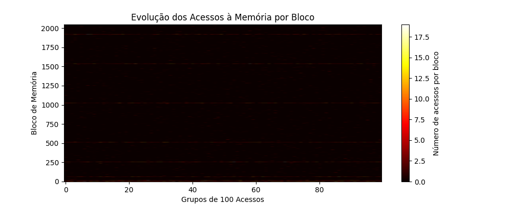

# Projeto de Simulação de Cache - HEATMAP

## Simulação de Cache - HEATMAP

Simulação de Cache - HEATMAP 
 - Algoritmo = FIFO
- Associatividade = 16
- Acessos = 10000
- Cache = 8192
- P_tem = 0.20000000298023224
- P_espa = 0.20000000298023224
- P_reg_quente = 0.4000000059604645

### Imagens Geradas

 INFORMAÇÃO DA IMAGEM:
Número de blocos - 256

 INFORMAÇÃO DA IMAGEM:
Número de blocos - 512

---

Autor: Pedro Henrique Bezerra de mello